# p7amjopgric7dfdi.onion

After solving the [SSSS](../006-third-onion/README.md#ssss-reconstruction) puzzles, solvers arrived for the private round of 2013. This is largely undocumented and any information is via leaks. This will be the least verifiable section. Users provided their email and potentially a PGP key.

## Questions

>It has been noted that the abstractness of these questions is very similar to the questions that Google supposedly asks its interviewees for serious roles at the company. They can supposedly be used to determine a person's personality and type.


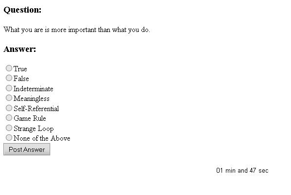

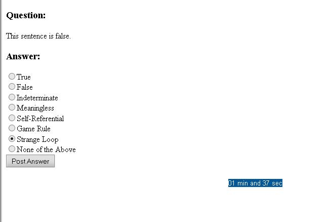


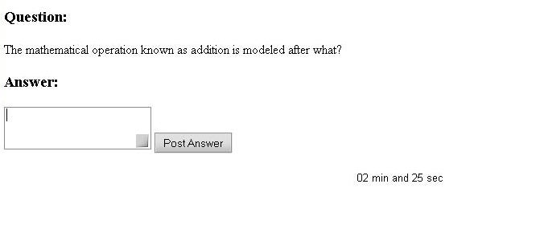
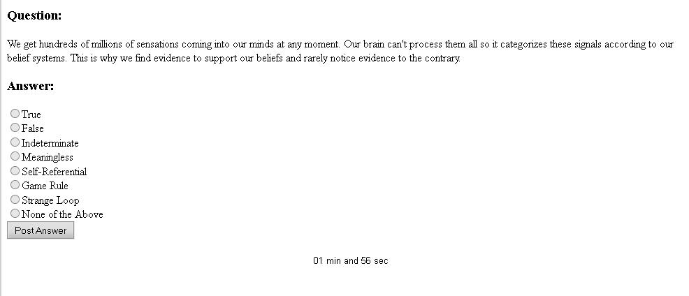
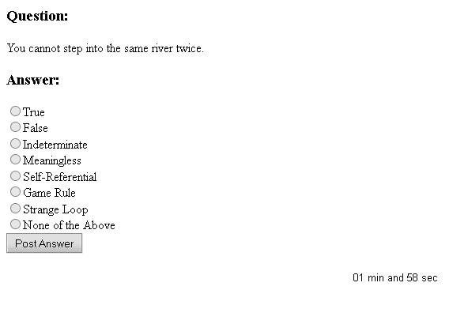


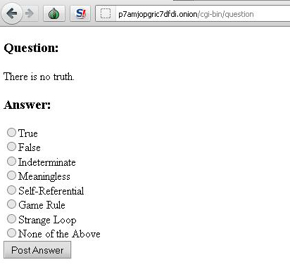
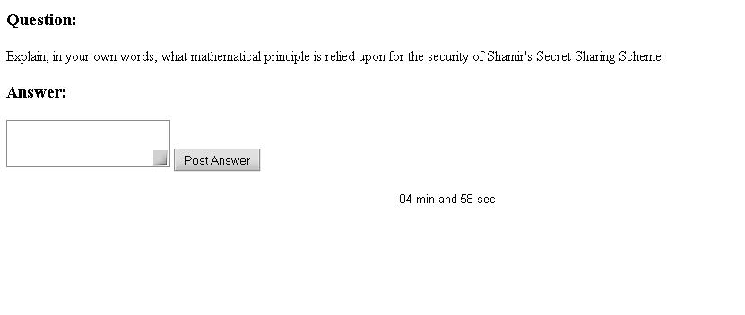
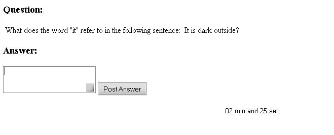
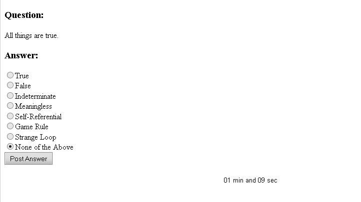
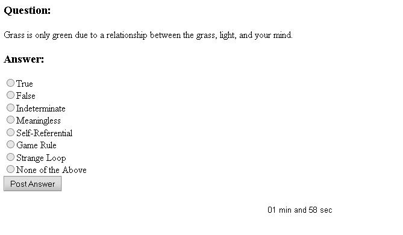
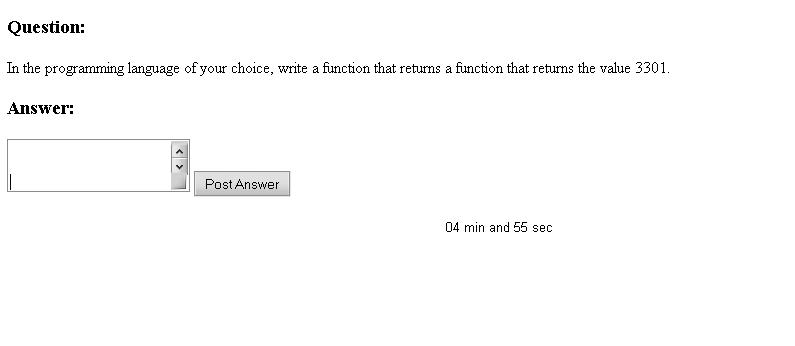

## Cookies

```
167=6941f707ff39d259ff71657a79cb6b54c184d2f0455810109c1a960860bde0e6;
761=7bc1e7805ccfa518920f0d94fc4e8f7dbd83287a03b337b89109cd2287befae5;
```

## The e-mail

By word of mouth, this e-mail is confirmed to be legitimate - the PGP signature has been removed so I cannot verify this.

The format is very RFC-like.

```
In the programming language of your choice build a TCP server
that implements the protocol below.  The server code must be
written by you and you alone, although you are free to use any
modules or libraries publicly available for the selected
programming language.

Once you have done this, make it accessible as a Tor hidden
service.  Then provide us with the onion address and port
via a GPG-encrypted email to this address.

You have until 0:00 UTC on 3 Feb, 2013.  Any emails received
after that time will be ignored.

Good luck.

3301

====================================================================


1. INTRODUCTION

   The TCP server MUST listen on an arbitrary port, and send and
   receive plain text with lines separated by <CRLF> (representing
   a carriage return followed by a line feed).  The TCP server MUST
   disregard the case of input.

   In the examples below, lines sent by the server will be preceded
   with "S:" and lines sent by the client will be preceded by "C:"

   Each message sent by the server MUST conform to the format:

       [CODE] [RESPONSE NAME] [RESPONSE (optional)]<CRLF>

   Where [CODE] and [RESPONSE NAME] is one of:

       CODE   RESPONSE NAME
        00     Welcome
        01     Ok
        02     Error
        03     Data
        99     Goodbye


2. PROCEDURES

   a. Remote Connection

   Upon receiving a remote connection, the server MUST greet the
   client with a 00 WELCOME message.  The RESPONSE of a welcome
   message MAY contain arbitrary text.  The arbitrary text MUST
   at the very least contain the name of the programming language
   used to implement the server.

   Upon receiving a 00 WELCOME message, the client may begin
   initiating procedures.

   Example:

       S: 00 WELCOME [ARBITRARY RESPONSE TEXT]<CRLF>


   b. RAND [n]
  
   Upon receiving a "RAND" request by the client, the server will
   first send a 01 OK response, and will then provide the client
   with [n] cryptographically random numbers within the range of
   0-255.  Each number MUST be followed by <CRLF>.  After the last
   number has been sent, the server MUST send a dot (.) on a line
   by itself.

   Example:

       C: RAND 3<CRLF>
       S: 01 OK<CRLF>
       S: [first random number]<CRLF>
       S: [second random number]<CRLF>
       S: [third random number]<CRLF>
       S: .<CRLF>


   c. QUINE

   Upon receiving a "QUINE" request by the client, the server will
   first send a 01 OK response, and will then provide the client
   with a quine in the programming language used to implement the
   server.  This quine does not have to be original.  After the last
   line of code has been sent, the server MUST send a dot (.) on a
   line by itself.

   Example:

       C: QUINE<CRLF>
       S: 01 OK<CRLF>
       S: [quine code]<CRLF>
       S: .<CRLF>
  

   d. BASE29 [n]

   Upon receiving a "BASE29" request by the client, the server will
   send a 01 OK response followed by the number [n] converted into
   its base 29 representation.

   Example:

       C: BASE29 3301<CRLF>
       S: 01 OK 3QO<CRLF>


   e. CODE

   Upon receiving a "CODE" request by the client, the server will
   send a 01 OK response followed by its own source code.  After the
   last line of code has been sent, the server MUST send a dot(.) on
   a line by itself.  

   Example:

       C: CODE<CRLF>
       S: 01 OK<CRLF>
       S: [Server Source Code]<CRLF>
       s: .<CRLF>


   f. KOAN

   Upon receiving a "KOAN" request by the client, the server will
   send a 01 OK response followed by a koan.  After the last line of
   the koan, the server MUST send a dot (.) on a line by itself.

   Example:

       C: KOAN<CRLF>
       S: 01 OK<CRLF>
       S: A master who lived as a hermit on a mountain was asked by a<CRLF>
       S: monk, "What is the Way?<CRLF>
       S: "What a fine mountain this is," the master said in reply<CRLF>
       S: "I am not asking you about the mountain, but about the Way.<CRLF>
       S: "So long as you cannot go beyond the mountain, my son, you<CRLF>
       S: cannot reach the Way," replied the master<CRLF>
       S: .


   g. DH [p]

   Upon receiving a "DH" request by the client, the server will proceed
   to perform a Diffie-Hellman key exchange using [p] as the prime modulus.
   The server will then select a base [b] to use in the protocol, as well as
   its secret integer.  The server will then compute its exponent result [e]
   as specified within the Diffie-Hellman key exchange protocol. 

   The server MUST then respond with a 01 OK response followed by the
   selected base [b] and computed exponent [e] separated by white space.

   The client MUST respond with its exponent result [e2], and the client and
   server will follow the rest of the Diffie-Hellman key exchange protocol.

   The server MUST then compute the resulting secret key, and provide it
   using 03 DATA [k].

   Example:

       C: DH 23<CRLF>
       S: 01 OK 5 8<CRLF>
       C: 19<CRLF>
       S: 03 DATA 2<CRLF>


   j. NEXT

   Upon receiving a "NEXT" request by the client, the server will respond
   with 01 OK and then listen for text data to be provided by the client. 
   The client will send a dot (.) on a line by itself after the last line
   of text.  The server MUST record this.  This data will be the next set
   of instructions.  Once the data is received the server will respond
   with 01 OK.

   Example:

       C: NEXT<CRLF>
       S: 01 OK<CRLF>
       C: -----BEGIN PGP SIGNED MESSAGE-----<CRLF>
       C: [MESSAGE CONTENTS]<CRLF>
       C: -----END PGP SIGNATURE-----<CRLF>
       C: .<CRLF>
       S: 01 OK<CRLF>


   i. GOODBYE

   Upon receiving a "DH" request by the client, the server MUST respond with
   99 GOODBYE and then gracefully close the connection.

   Example:

       C: GOODBYE<CRLF>
       S: 99 GOODBYE<CRLF>
```

## Didn't receive an e-mail

```
-----BEGIN PGP SIGNED MESSAGE-----
Hash: SHA1


If you followed the rule but did not receive an email,
send us an email to let us know at: c1231507051321@gmail.com

Make sure your GPG key is accessible.

3301

-----BEGIN PGP SIGNATURE-----
Version: GnuPG v1.4.11 (GNU/Linux)

iQIcBAEBAgAGBQJRBDvtAAoJEBgfAeV6NQkPeMAP/1ZW98z6xpsQfqN0Ceq0AAQ1
znZYnHP6V+BLmxx1fvtSCp7GHTOQQTZyymHdbxBLs077IaYyZU6AUEP+tmLxod11
OBFLT6rRjlwS7Dwk2A5HiHr7B0MX30eh2nhDvQLQBXC+Dp5SGtwIyCOKbsFu7zAn
UKrMu40Mu0vCYMi2nuHIhplS8JDastMFQV6o+zhJEes6QAu461YgO67dkG8WO/42
4KrXO8YvWgnfvF4+Afd5gG2eMW/6iCLw40H8jEADOA/Ih+8W0bSWshZElQ3+lJ0h
9OVV7NqHBRiUB1zuZtXGKUMdJkcpfTZixln8fmL9qr5CtM+NTYnTbnLhbNGI7foE
LKOKqxMmcycawezIlqpP/i1usXnvXFWjYchn3O63kOVpuHv5GpPoJObg1ViFcFiC
eV3b7kifN0doK6icjpSqJDky5w4wknXfQviac7MqwiXpo38K0X4SgKjBXx+Irwig
lvaQs0Wx5zocFf92Ynnrmhi8bEBG7Za3XoUZRlK7Be8RjNbE3oYokwq/dZ2mVzKN
ahrx4uRGHQwqoTn7AHi8gXvhVvUmAQCMRdZxLuGyzmXfusfU6QM0UaDEr1zLxDPx
Wg/5tjJzlaEDMrnIWFJCbvypCJyCLbiLly4pqf8ztL3W6Un6pCeFeEtBWDO6j5Ts
O1zUHySHV/spayzmkcz8
=Qm21
-----END PGP SIGNATURE-----
```

## TCP server implementation

This server implementation is likely to weed out those who can program and those who can't as well as assess their decisions to over-engineer or write secure code. Despite the protocol being fairly simple, there are many issues to be encountered in implementation. See my (mostly complete) implementation at [server.py](./server.py).

1. You are taking in untrusted user input, you should be sanitizing it.
2. You are taking in a prime that you should validate which could cause a denial of service attack on your server, the primality check should be put on a thread and killed via timeout.
3. What if multiple clients connect and send data? You should like handle each client on a separate thread.
4. One of the more question inducing pieces is recording in all data from an untrusted source. Since no one wants to miss a puzzle piece, I'm sure everyone wasn't sanitizing the next command in the event receiving the data was another piece and not ASCII.
    - Lets say they crash your code and are able to drop shellcode somewhere in memory. Even if they didn't get an execution the first pass or it is not a segfault, they could go for the eggdrop route. The same could be said as using it as a dropper to the filesystem and using another vulnerability to use it.

### Cicada starts testing

The following are logs from Cicada's testing. It is clear that a few commands are trying to spot flaws in implementation despite the terse nature/unthoroughness of testing. You may see a messier log [here](../008-invitation/Nj8gDqFG) which showed the [`invitation`](../../2012/010-invitation/invitation.asc) from 2012.

```
2013/02/25 14:32:01 server is running under address [::]:3307
2013/03/03 10:57:48 got connection from 127.0.0.1:42483
2013/03/03 10:58:05 executing 'rand 3' for 127.0.0.1:42483
2013/03/03 10:58:09 executing 'rand 3' for 127.0.0.1:42483
2013/03/03 10:58:18 executing 'rand 0' for 127.0.0.1:42483
2013/03/03 10:58:29 executing 'rand 1' for 127.0.0.1:42483
2013/03/03 10:58:56 executing 'quine' for 127.0.0.1:42483
2013/03/03 10:59:10 executing 'base29 1033' for 127.0.0.1:42483
2013/03/03 10:59:14 executing 'koan' for 127.0.0.1:42483
2013/03/03 10:59:16 executing 'koan' for 127.0.0.1:42483
2013/03/03 10:59:18 executing 'koan' for 127.0.0.1:42483
2013/03/03 10:59:21 executing 'koan' for 127.0.0.1:42483
2013/03/03 10:59:28 executing 'dh 3301' for 127.0.0.1:42483
2013/03/03 10:59:56 executing 'dh 3301' for 127.0.0.1:42483
2013/03/03 11:00:29 executing 'dh 3301' for 127.0.0.1:42483
2013/03/03 11:00:58 executing 'next' for 127.0.0.1:42483
2013/03/03 11:01:11 executing 'dh' for 127.0.0.1:42483
2013/03/03 11:01:18 executing 'goodbye' for 127.0.0.1:42483
2013/03/03 11:01:18 closing connection to 127.0.0.1:42483
```