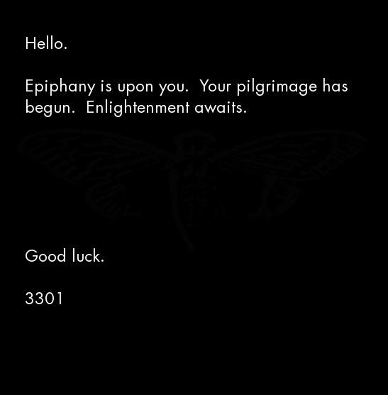

# Twitter

On Jan 5th 2014, Cicada posted the following image from the [2012 Twitter](../../2013/003-twitter/README.md#twitter)



## Outguess

Following suit of past puzzles, running through outguess gives the following result.

See [here](./zN4h51m.jpg.asc)

```
-----BEGIN PGP SIGNED MESSAGE-----
Hash: SHA1


The work of a private man
who wished to transcend,
He trusted himself,
to produce from within.


1:2:3:1
3:3:13:5
45:5:2:3
20:3:20:5
8:3:8:6
48:5:14:2
21:13:4:1
25:1:7:4
15:9:3:4
1:1:16:3
4:3:3:1
8:3:26:4
47:3:3:5
3
13:2:5:4
1:4:16:4
.
o
n
i
o
n

Good luck.

3301


-----BEGIN PGP SIGNATURE-----
Version: GnuPG v1.4.11 (GNU/Linux)

iQIcBAEBAgAGBQJSyjguAAoJEBgfAeV6NQkPsgAP/A3tMC3lpyFNAc/sj+Izu15S
CzUjZJMe20Gu9UMNokQ2UJabktv9w0GMyK17TrMkUcU+ZpjdzGNqKoE2ETVxLmD/
uBZtR5PnF9EE3D08tJUPN1vSrYNkYk+9zcaUJZMPNgYNCt/CACutPwrOci9i9FDO
7BIpnhGqT3ZruqrSwO2Y73LJI1xxUt1XUqh1NQ+fJeAFMRkJBZZazkxRlgk3GGsF
fLrcEKrS+KBipV1EQaaKxjISc9hc2c1TfxE66evlkN+zLcoyDcYuyruNM5wiZzgM
2uR58c+xgWQgG5UuLFClfvjDxUvDkrKt4mzEeaYSUm1MsYueuYklz4ydlg5Mf6l2
p1WyAxO52XfXVUZASk6VmaEQ0WjODTXvLeFTxUSDoKDMkvxDVxX6wGkufS9JwakB
nTZizZ8Ypv8GcNCuNNGd6gZ1Vk2MYntggXdX8INd0Itcd3QnLqbBnATDOinDxlOs
5zTrtyTHNaxxDagPfAbU1jMXM0aHd7PFAzjjp7kgCTWqMyBch+8Vt80bjkdL9iw8
Q3hxuanq8mh6nUGc+tNe0UfqKHEbE+jWIezYqgawJB0M9R5OhxWE+E+jPXtZKkXQ
JHYndPDrrsV8q27b7p0KN0+oblTkjqsItIAuLu7FNd0B4xb1jjp1Sbh7WJdZ/rbi
mCO0vN/obU9qK1Vfapy0
=6Gxk
-----END PGP SIGNATURE-----
```

## Book code

After doing some Google dorking, one can find the book this is referring to within a few results.

Dork used (the `-cicada` is important to play like the original solvers did):

`The work of a private man who wished to transcend, He trusted himself, to produce from within. -cicada`

Within a few pages of results, I found [this](https://americainclass.org/individualism-in-ralph-waldo-emersons-self-reliance/) result.

The book is *Self-Reliance* by Ralph Waldo Emerson. You can find a copy within the repo [here](./self-reliance.pdf).

The book code is of the format `paragraph:sentence:word:letter`. After solving, (see [book-code.py](./book-code.py)) - you are left with `auqgnxjtvdbll3pv.onion`.

