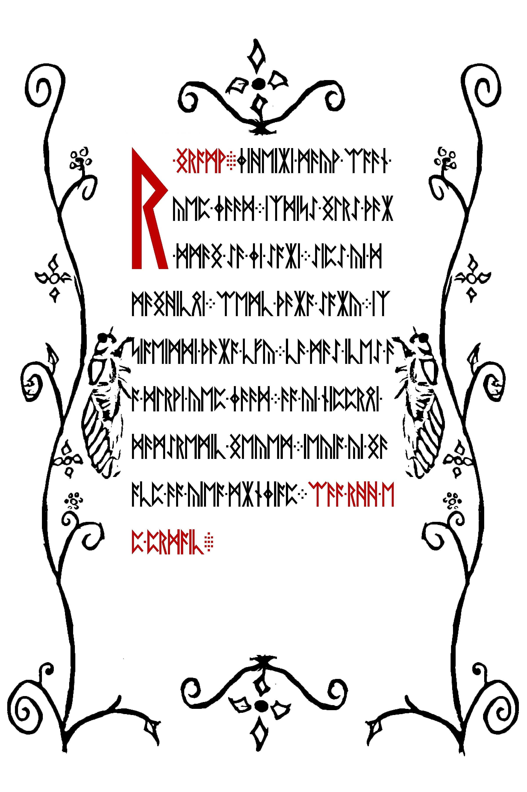

# First three pages (Intus, Liber Primus, and runes)

In the [second onion](../003-second-onion/) we decoded three JPGs from the hex blob posted to the hidden service.

## Runes




```
ᚱ-ᛝᚱᚪᛗᚹ.ᛄᛁᚻᛖᛁᛯᛁ-ᛗᚫᚥᚹ-ᛠᚪᚫᚾ-/
ᚥᛖᛈ-ᛄᚫᚫᛞ.ᛁᛉᛞᛁᛋᛇ-ᛝᛚᚱᛇ-ᚦᚫᛯ/
-ᛞᛗᚫᛝ-ᛇᚫ-ᛄᛁ-ᛇᚪᛯᛁ.ᛇᛁᛈᛇ-ᚥᛁ-ᛞ/
ᛗᚫᛝᚻᛁᚳᛟᛁ.ᛠᛖᛗᚳ-ᚦᚫᛯᚪ-ᛇᚪᛯᚥ.ᛁᛉ/
ᛋᛁᚪᛖᛁᛗᛞᛁ-ᚦᚫᛯᚪ-ᚳᚠᚥ.ᚳᚫ-ᛗᚫᛇ-ᛁᚳᛖᛇ-ᚫ/
ᚪ-ᛞᛚᚱᚹᛁ-ᚥᛖᛈ-ᛄᚫᚫᛞ.ᚫᚪ-ᚥᛁ-ᚾᛁᛈᛈᚱᛟᛁ-/
ᛞᚫᛗᛇᚱᛖᛗᛁᚳ-ᛝᛖᚥᛖᛗ.ᛁᛖᚥᛁᚪ-ᚥᛁ-ᛝᚫ/
ᚪᚳᛈ-ᚫᚪ-ᚥᛁᛖᚪ-ᛗᛯᚾᛄᛁᚪᛈ.ᛠᚫᚪ-ᚱᚻᚻ-ᛖ/
ᛈ-ᛈᚱᛞᚪᛁᚳ./
```

Using the [gematria primus](../../2013/003-twitter/gematria.jpg) to solve the runes produces ciphertext. The runes are encrypted with a different key. Reversing the runes mapping to letters is the key for this puzzle. See [gematriaprimus.py](02.jpg.runes/gematriaprimus.py) to solve. 

Since the letters can have multiple values, the exhaustive result list can be huge. I've limited this by disallowing bigrams that do not occur in the English language. A valid decrypt will look something like this, with some minor adjustments still needing to be made.

```
A-WARNING.BELIEUE-NOTHING-FROM-/
THIS-BOOK.EXKEPT-WHAT-YOU/
-KNOW-TO-BE-TRUE.TEST-THE-K/
NOWLEDGE.FIND-YOUR-TRUTH.EX/
PERIENKE-YOUR-DEATH.DO-NOT-EDIT-O/
R-KHAINGE-THIS-BOOK.OR-THE-MESSAGE-/
KONTAINED-WITHIN.EITHER-THE-WO/
RDS-OR-THEIR-NUMBERS.FOR-ALL-I/
S-SAKRED./
```

And corrected:

```
A-WARNING.BELIEVE-NOTHING-FROM-/
THIS-BOOK.EXCEPT-WHAT-YOU/
-KNOW-TO-BE-TRUE.TEST-THE-K/
NOWLEDGE.FIND-YOUR-TRUTH.EX/
PERIENCE-YOUR-DEATH.DO-NOT-EDIT-O/
R-CHANGE-THIS-BOOK.OR-THE-MESSAGE-/
CONTAINED-WITHIN.EITHER-THE-WO/
RDS-OR-THEIR-NUMBERS.FOR-ALL-I/
S-SACRED./
```

## Outguess hex (see [outguess from second onion](../003-second-onion/README.md#outguess))

To decode the outguess messages in the three pictures, we again are using 3301's favorite method - XOR. See [xor.py](xor.py).

```bash
$ gpg -d ../003-second-onion/00.jpg.asc > 00.asc.hex
$ gpg -d ../003-second-onion/01.jpg.asc > 01.asc.hex
$ gpg -d ../003-second-onion/02.jpg.asc > 02.asc.hex
$ xxd -r p 00.asc.hex > 00.asc.bin
$ xxd -r p 01.asc.hex > 01.asc.bin
$ xxd -r p 02.asc.hex > 02.asc.bin
$ ./xor.py 00.asc.bin 01.asc.bin 00^01.bin
$ ./xor.py 00^01.bin 02.asc.bin 00^01^02.asc
$ gpg --verify 00^01^02.asc
```

## PGP message from [XOR of PGP messages](#outguess-hex-see-outguess-from-second-onion) in 3 first pages

```
-----BEGIN PGP SIGNED MESSAGE-----
Hash: SHA1


IDGTK UMLOO ARWOE RTHIS UTETL HUTIA TSLLO 
UIMNI TELNJ 7TFYV OIUAU SNOCO 5JI4M EODZZ 

Good luck.

3301


-----BEGIN PGP SIGNATURE-----
Version: GnuPG v1.4.11 (GNU/Linux)

iQIcBAEBAgAGBQJSy23PAAoJEBgfAeV6NQkPeJwP/0IoafJ1SbmhD+KNbL5I2EdH
jgPRnZNrKCyMpWFSIw1qs6ujuw6VnW/rfnOD+df4kpzoAwEFfZDcRnBVsvIzOJ31
Txj9jXD22ki/CNRY88NyIzW9fjKs+iOylsa7Tx+6PBb3ndoYNEwnQwLIq3K4S3kQ
tgMzE3LiVq2pQwqFNdN+zGqcq7POEs0GmnL1aNpqU+Wrba4gSfoWwQBWUDv3S/s8
vY0hEqhWNd76wphig6hH6OyIaX/t1eYfcsSYhzAE5oKKahGr1E7cX1GBpHCIr1WM
ZwNaGVArQAkyEzT++tmF01O9h218CiTUFoBM/Zxyra7vxI2UOYS/pLonuV+eXARY
YfPHaZZxfk3bUWXcxioRukFSY2+xNdPfuBIT8rcJqa1kPJOzeZVC/IcwHA2mmG4l
3ltiVcDnQrZgz6Im3/ugFg8bqW12qqZ6XizRP3EXm4EnyhpfKZnXKPLEOvPKCj6j
1kYCrLmGtTTPFx79fZfryGXQIEAmipRbjVS5sVbUCfgmqUagmdU6v9VI53n6+r0J
b2amxREA+2MflkEoVJUaLQJ1rKZLFFJ9J17zUaXKMllsDBWXJS4Mb54o2+8bkEcM
3cP+16XV9pf2wZBkJE0AwoXI4L8JEyjNZZcGSLy8BojlAupX3Fg9KKt71XXrm9FD
tuBhMYWo/TDz+4UzLB+I
=57tj
-----END PGP SIGNATURE-----
```